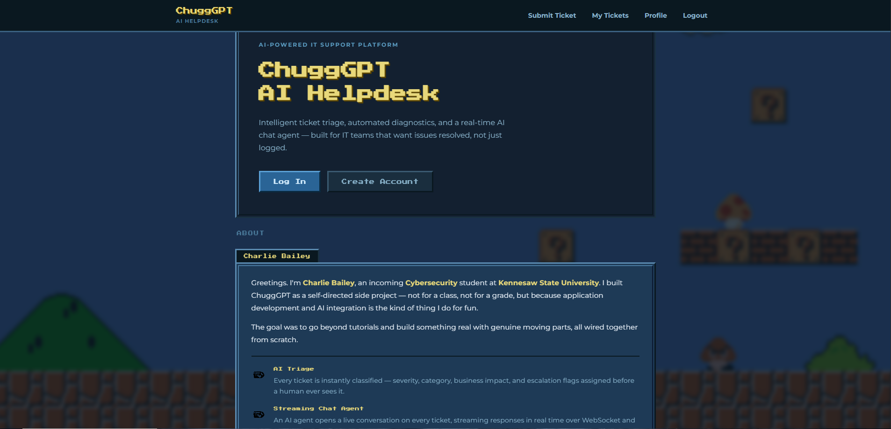
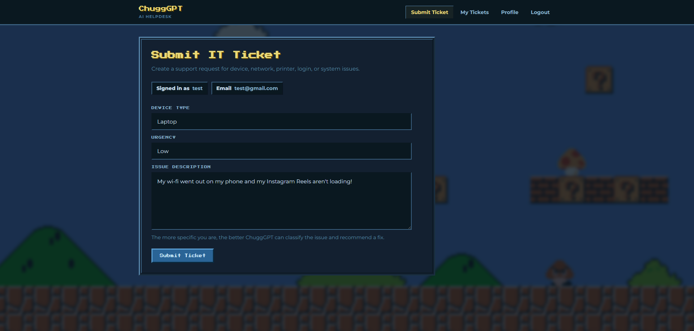
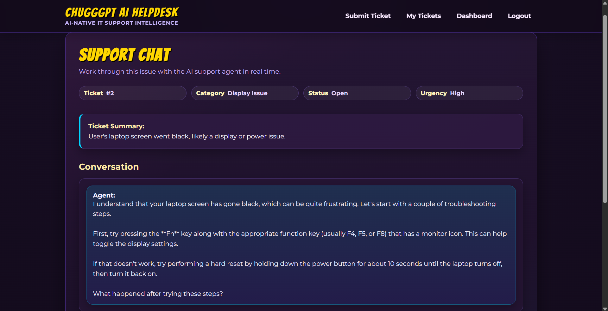
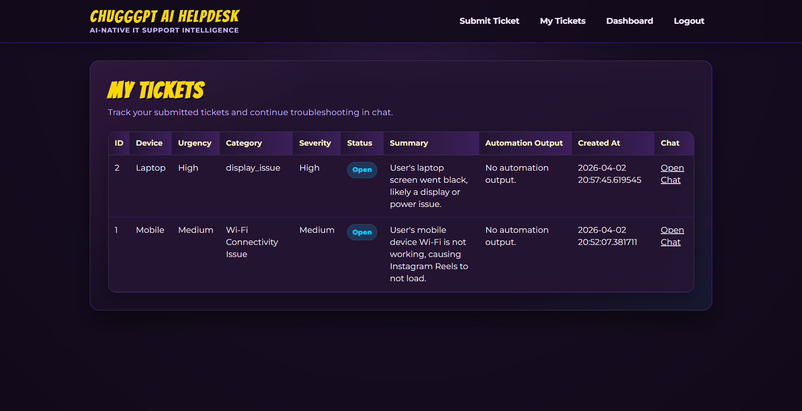
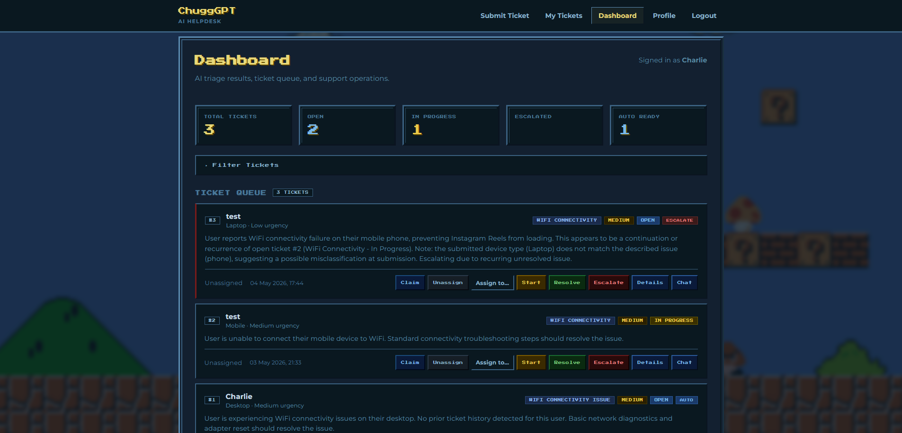
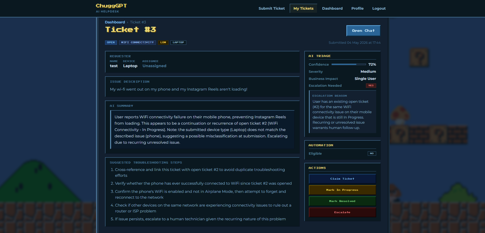

# ChuggGPT AI Helpdesk

A full-stack AI-powered IT helpdesk platform built as a self-directed side project by **Charlie Bailey**, Cybersecurity student at **Kennesaw State University**. Built to learn and improve skills in application development and AI integration — not for a class, not for a grade.

---

## Screenshots

### Homepage


### Submit Ticket


### AI Support Chat


### My Tickets


### Admin Dashboard


### Ticket Detail


---

## What It Does

Users submit IT support tickets. The moment a ticket lands, Claude (claude-sonnet-4-6) triages it — predicting category, severity, business impact, and escalation risk — and opens a live chat session. The AI support agent streams responses in real time over WebSocket, walks the user through troubleshooting step by step, and can trigger simulated diagnostic automations. Admins get a full dashboard with filters, status controls, assignment, automation execution, and an audit log.

---

## Features

**User**
- Account signup and login
- Ticket submission
- Ticket history with filters
- Real-time AI chat (streaming over WebSocket)

**AI**
- Ticket triage on submission: category, severity, business impact, confidence score, escalation flag
- Streaming chat agent that troubleshoots step by step and asks follow-up questions
- Automation marker extraction — AI can trigger safe diagnostics mid-conversation
- Conversation history passed back to Claude each turn for context continuity

**Admin**
- Full ticket queue with search and filters (status, category, severity, name)
- Ticket claiming, assignment, and status updates
- One-click automation execution from the dashboard
- Audit log for all actions

**Automation (simulated)**
- DNS flush
- Network reset
- Printer restart
- Disk cleanup
- Password reset workflow
- Risk-level policy — high-risk automations block when triggered by AI, require admin confirmation

**Security**
- Session-based auth via signed cookies (Starlette SessionMiddleware)
- WebSocket authentication reads from session — user ID is never trusted from the client
- XSS prevention: all markdown rendered through DOMPurify before hitting the DOM
- Rate limiting on login (10/min), signup (5/min), and ticket submission (10/min) via slowapi
- Input length caps on all user-facing fields
- Security headers on every response: `X-Frame-Options`, `X-Content-Type-Options`, `Referrer-Policy`, `Permissions-Policy`
- Cascade delete — removing a ticket cleans up all child records (chat sessions, messages, predictions, automation runs)
- `.env` and database file excluded from version control

---

## Tech Stack

| Layer | Technology |
|---|---|
| Backend | FastAPI, SQLAlchemy, SQLite |
| Frontend | Jinja2, HTML, CSS, JavaScript |
| AI | Anthropic API (claude-sonnet-4-6) |
| Real-time | WebSockets |
| Auth | Starlette SessionMiddleware |
| Rate limiting | slowapi |
| Markdown | marked.js + DOMPurify |

---

## Project Structure

```
chuggGPT-helpdesk/
├── app/
│   ├── routes/
│   │   ├── auth.py          # Login, signup, profile, logout
│   │   ├── tickets.py       # Submit, my-tickets, ticket detail
│   │   ├── dashboard.py     # Admin dashboard and actions
│   │   └── chat.py          # Chat page + WebSocket handler
│   ├── services/
│   │   ├── ai_triage.py     # Structured ticket triage via Claude
│   │   ├── chat_agent.py    # Streaming chat agent
│   │   ├── automation.py    # Automation execution and audit logging
│   │   └── automation_policy.py
│   ├── templates/           # Jinja2 HTML templates
│   ├── static/              # CSS and images
│   ├── database.py
│   ├── models.py
│   ├── limiter.py           # slowapi rate limiter
│   ├── main.py
│   └── create_admin.py
├── screenshots/
├── requirements.txt
├── .env.example
└── .gitignore
```

---

## Running Locally

```bash
# Clone
git clone https://github.com/charliepb19/chuggGPT-helpdesk.git
cd chuggGPT-helpdesk

# Create and activate virtual environment
python -m venv venv
.\venv\Scripts\Activate.ps1      # Windows
source venv/bin/activate          # macOS/Linux

# Install dependencies
pip install -r requirements.txt

# Set up environment variables
cp .env.example .env
# Edit .env and add your ANTHROPIC_API_KEY and a long random SESSION_SECRET

# Start the server
uvicorn app.main:app --reload
```

Open `http://127.0.0.1:8000`

---

## Creating an Admin Account

```bash
python -m app.create_admin
```

Follow the prompts, then log in with those credentials to access the dashboard.

---

## Environment Variables

| Variable | Description |
|---|---|
| `ANTHROPIC_API_KEY` | Your Anthropic API key |
| `SESSION_SECRET` | Long random string for signing session cookies |

---

## License

MIT
